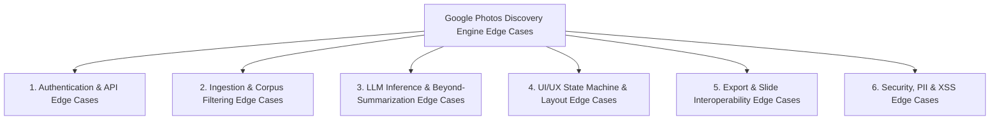

# Master Edge Case & Corner Case Specification: AI-Powered Discovery Engine for Google Photos

**Project Title:** AI-Powered Discovery Engine for Google Photos (Internal PM Intelligence Tool)  
**Target Organization:** Google LLC — Personal Search & Google Photos (`com.google.android.apps.photos`)  
**Target Users:** Google Photos Core Experience & Semantic Search Product Managers (PMs)  
**Domain:** Computational Photography, Semantic Image Retrieval & Personal Knowledge Management (PKM)  
**Document Version:** 1.0.0  
**Status:** Approved Edge Case Baseline  
**Reference Documents:**  
* [problemStatement.md](file:///c:/Users/DELL/OneDrive/Desktop/Krishna/Google%20Photos%203/Google%20photos%20AI%20discovery%20engine/problemStatement.md)  
* [architecture.md](file:///c:/Users/DELL/OneDrive/Desktop/Krishna/Google%20Photos%203/Google%20photos%20AI%20discovery%20engine/architecture.md)  
* [implementation-plan.md](file:///c:/Users/DELL/OneDrive/Desktop/Krishna/Google%20Photos%203/Google%20photos%20AI%20discovery%20engine/implementation-plan.md)  

---

## 1. Executive Overview & Philosophy of Corner Case Resilience

The **AI-Powered Discovery Engine for Google Photos** is an internal, executive-level analytics platform designed to analyze multi-channel user feedback and conversations about photo retrieval at scale. Because this tool generates strategic inputs for product roadmaps, OKRs, and executive slide presentations, it must strictly avoid conversational drift, superficial sentiment summaries, hallucinated insights, or visual UI instability.

This document identifies all known **corner cases, failure modes, race conditions, security boundaries, and syntax anomalies** across the system, detailing proactive architectural mitigations for each.



---

## 2. Deep-Dive Edge Case Specifications

### Category 1: Authentication & API Edge Cases

#### 1.1 Triggering Workflow with No API Key Entered
- **Trigger Condition:** User opens the application and immediately clicks one of the 4 workflow buttons without typing into the API key configuration input.
- **Failure Mode:** Unauthenticated API request returns HTTP 400/401; user is exposed to cryptic raw JSON network errors.
- **System Mitigation:**
  - Client-side pre-flight check intercepts the action before initiating any network request.
  - State machine transitions immediately to `ERROR` state.
  - Displays a high-visibility Material Red alert banner: *"API Key Required: Please enter your Google Gemini API key in the configuration card on the left sidebar before triggering this analytical workflow."*
  - The API key input is programmatically focused with an animated focus ring.

#### 1.2 Invalid, Expired, or Revoked API Key (HTTP 401 / 403)
- **Trigger Condition:** User enters a random string, a revoked key, or a key lacking Google AI Studio Generative Language API permissions.
- **Failure Mode:** Backend rejects request with `401 Unauthorized` or `403 Forbidden`.
- **System Mitigation:**
  - `GeminiClient` inspects the HTTP status code and intercepts the raw response.
  - Translates the error into an executive diagnostic banner: *"Authentication Failed (401/403): Your Gemini API key is invalid or unauthorized. Please verify your Google AI Studio credentials."*
  - Provides a 1-click "Retry Workflow" button.

#### 1.3 Google AI Studio Rate Limiting / Quota Exhaustion (HTTP 429)
- **Trigger Condition:** The user triggers multiple workflows in rapid succession, exceeding the 60 RPM or 100K TPM budget on the free Gemini 1.5 tier.
- **Failure Mode:** API returns `429 Resource Exhausted`.
- **System Mitigation:**
  - Intercepted specifically by the client error handler.
  - Alerts the user: *"Rate Limit Exceeded (429): Google AI Studio quota exceeded. Please wait 30 seconds before triggering another analytical workflow."*
  - Workflow trigger buttons are temporarily locked to prevent aggressive API hammering.

#### 1.4 Accidental Whitespace, Newlines, or Surrounding Quotes in Pasted API Key
- **Trigger Condition:** User copies the key from email, Slack, or Google Docs with surrounding spaces, tabs, or quotes (e.g., `" AIzaSy... "` or `'AIzaSy...'`).
- **Failure Mode:** Key rejected by Google authentication service due to invalid character encoding.
- **System Mitigation:**
  - The `GeminiClient` and `ApiKeyCard` apply automatic sanitization: `.trim().replace(/^["']|["']$/g, "")` on input change and before dispatch.

#### 1.5 Complete Network Disconnect / Captive Portal / Offline State
- **Trigger Condition:** User's device loses Wi-Fi or encounters a corporate firewall blocking `generativelanguage.googleapis.com`.
- **Failure Mode:** Unhandled `TypeError: Failed to fetch` crashes the script.
- **System Mitigation:**
  - Network `try...catch` block intercepts network failures and emits: *"Network connection failed. Unable to reach Google AI Studio. Please verify your internet connection or proxy settings."*

---

### Category 2: Ingestion & Corpus Filtering Edge Cases

#### 2.1 All Data Sources Unchecked (Zero-Record Corpus)
- **Trigger Condition:** PM unchecks all 4 checkboxes (`r/GooglePhotos`, `Play Store`, `App Store`, `Google Support Forum`).
- **Failure Mode:** Prompt sent to Gemini containing an empty dataset `[]`, causing the model to hallucinate or generate generic conversational filler.
- **System Mitigation:**
  - Pre-flight validation checks `corpusStore.getActiveRecords().length === 0`.
  - Disallows request dispatch and displays an inline alert: *"No Ingestion Sources Selected: All feedback channels are currently disabled. Please enable at least one VoC source in the sidebar to run the analytical synthesis."*
  - Counter badge displays `0 of 7 Records` in high-contrast red/orange alert style.

#### 2.2 Highly Skewed or Single-Source Selection (Sparse Data)
- **Trigger Condition:** PM selects only the Apple App Store (which contains exactly 1 review in the seed dataset).
- **Failure Mode:** The model has insufficient feedback to generate 3 distinct edge-case categories or 4 distinct workarounds.
- **System Mitigation:**
  - The system prompt instructs the model to exhaustively analyze available data and note data sparsity if evidence is constrained.
  - Active record counter prominently indicates `1 of 7 Records`, warning the PM of low statistical sample size.

#### 2.3 Malformed or Corrupted Feedback Objects
- **Trigger Condition:** A custom ingested record is missing required fields (e.g., `content` is `undefined`, or `metadata` is `null`).
- **Failure Mode:** Stringification crashes or prompt outputs `[object Object]`.
- **System Mitigation:**
  - Ingestion validator enforces schema defaults:
    ```javascript
    content: record.content || "No review text provided",
    metadata: record.metadata || { date: "Unknown", tags: [] }
    ```

---

### Category 3: LLM Inference, Beyond-Summarization & Syntax Contract Edge Cases

#### 3.1 Conversational Chatbot Drift (Pleasantries & Preamble)
- **Trigger Condition:** LLM defaults to chat persona and prepends conversational filler (e.g., *"Certainly! As a Principal PM for Google Photos, here is my detailed taxonomy..."* or *"I hope this helps your product strategy!"*).
- **Failure Mode:** Violates the non-negotiable **"Zero Chatbot"** requirement; prevents clean 1-click copying into executive slide decks.
- **System Mitigation:**
  - System prompt includes negative constraints: `"Do NOT include conversational opening or closing statements. Output ONLY the structured analysis."`
  - Clamped parameters (`Temperature: 0.2`, `Top_P: 0.8`) keep output strictly deterministic and anchored to instructions.

#### 3.2 Regression into Naive Review Summarization or Sentiment Analysis
- **Trigger Condition:** The model defaults to summarizing customer feedback (e.g., *"Overall, 68% of users feel negative about search accuracy..."*) instead of deconstructing cognitive failure mechanics.
- **Failure Mode:** Violates the strategic core mandate of going beyond sentiment analysis and summarization.
- **System Mitigation:**
  - System prompts explicitly forbid generic summary prose and polarity scoring.
  - Prompts require structured classification: taxonomy categorization, cognitive gap T-Charts, friction-scored workarounds, and concrete POAs with testable hypotheses.

#### 3.3 Hallucinated Customer Quotes (Synthetic Evidence)
- **Trigger Condition:** LLM invents dramatic or plausible-sounding quotes not found in the ingested corpus.
- **Failure Mode:** PM bases engineering roadmaps on fictitious user complaints; breaks factual ground-truth contract.
- **System Mitigation:**
  - Explicit prompt instruction: `"For each category, provide a definition and a direct verbatim quote from the provided data as empirical evidence."`
  - Seed dataset is explicitly serialized into the input prompt payload so the model has direct in-context ground truth.

#### 3.4 Workflow 4 Missing Comparison / Trade-off Matrix
- **Trigger Condition:** Model generates POA 1 and POA 2 but stops without outputting the Trade-off Matrix table.
- **Failure Mode:** Violates the product rubric and engineering roadmap specification.
- **System Mitigation:**
  - Workflow 4 prompt explicitly requires: `"Following POA 2, include an H2 header: '## Comparison / Trade-off Matrix'. Render a structured Markdown Table comparing POA 1 vs POA 2 with the columns: | Evaluation Dimension | POA 1: [Short Title] | POA 2: [Short Title] | Covering rows for: Specific Retrieval Problems Solved, User Impact, Implementation Effort, and Strategic Recommendation."`
  - Acceptance testing asserts that the table is present and correctly structured.

#### 3.5 Malformed Markdown Table Syntax in Workflow 2 & Workflow 4
- **Trigger Condition:** LLM produces unaligned pipes `|`, omits the separator row `|---|---|`, or inserts inconsistent cell counts.
- **Failure Mode:** Raw unformatted pipes render on the screen, creating visual layout breakages.
- **System Mitigation:**
  - The AST parser in `markdownRenderer.js` uses regex row identification and gracefully handles uneven cell counts by padding empty `<td>` tags.

#### 3.6 Incomplete or Cut-Off Response (`maxOutputTokens` Exhaustion)
- **Trigger Condition:** The model generates overly verbose text that exceeds the `maxOutputTokens: 2048` boundary.
- **Failure Mode:** Text terminates mid-sentence or mid-table.
- **System Mitigation:**
  - Strict output instructions mandate concise executive bullet points.
  - `maxOutputTokens` is set to 2048, providing ample room for the structured reports.

---

### Category 4: UI/UX State Machine & Layout Edge Cases

#### 4.1 Rapid Multi-Clicking on Workflow Buttons (Race Condition)
- **Trigger Condition:** PM impatiently clicks Workflow 1, then Workflow 2, then Workflow 3 in under 1 second.
- **Failure Mode:** Multiple overlapping asynchronous fetch promises resolve in unpredictable order, causing the canvas to flicker and display the wrong workflow report.
- **System Mitigation:**
  - All 4 workflow buttons are disabled immediately upon initiating a request (`btn.disabled = true`).
  - Active workflow button displays an in-progress indicator.
  - Buttons are re-enabled only after the active request resolves or fails.

#### 4.2 Extremely Long Generated Report Exceeding Viewport Height
- **Trigger Condition:** A multi-section report spans several thousand vertical pixels.
- **Failure Mode:** Main container scrolls off-screen; header and control sidebar disappear.
- **System Mitigation:**
  - Desktop-first layout enforces independent scrolling:
    - Sidebar has `overflow-y: auto`.
    - Main Canvas has `overflow-y: auto`.
    - Canvas navigation bar has `position: sticky; top: 0; z-index: 10;`.
    - The top app header remains anchored at the top of the viewport.

#### 4.3 Password Visibility Toggle State Persistence
- **Trigger Condition:** User toggles the eye icon to view their pasted key, then triggers a workflow.
- **Failure Mode:** Screen sharing during PM meetings accidentally exposes the raw key.
- **System Mitigation:**
  - Input field defaults strictly to `type="password"`.
  - The toggle button provides clear visual feedback (swapping eye and eye-off SVG icons).

---

### Category 5: Export & Clipboard Interoperability Edge Cases

#### 5.1 Browser Blocks Async Clipboard API Access
- **Trigger Condition:** App run in an insecure HTTP context, embedded iframe, or browser where `navigator.clipboard` is restricted.
- **Failure Mode:** `navigator.clipboard.writeText()` throws a DOMException security error; copy silently fails.
- **System Mitigation:**
  - `ClipboardService.copyText()` implements an automatic dual-layer fallback using an off-screen `textarea` and `document.execCommand('copy')`.
  - Emits user-facing toast confirming success or instructing manual selection if both methods fail.

#### 5.2 PM Clicks Copy Button Before Report Generation
- **Trigger Condition:** User clicks the Copy button while the app is in `IDLE`, `LOADING`, or `ERROR` state.
- **Failure Mode:** Copies empty string or error message to clipboard, overwriting existing clipboard contents.
- **System Mitigation:**
  - The "Copy to Clipboard" button has `disabled = true` during `IDLE`, `LOADING`, and `ERROR` states.
  - Button is enabled strictly upon successful transition to `SUCCESS` state.

#### 5.3 Repeated Rapid Clicking on "Copy to Clipboard"
- **Trigger Condition:** PM clicks "Copy to Clipboard" 5 times in 2 seconds.
- **Failure Mode:** Toast animation timers conflict, causing the toast to flash or disappear prematurely.
- **System Mitigation:**
  - Debounced toast timer: existing timeouts are cleared before scheduling a new 2.5-second dismissal.

---

### Category 6: Security, PII & XSS Edge Cases

#### 6.1 Accidental API Key Leakage via Page Storage or URL Telemetry
- **Trigger Condition:** User enters their personal Gemini API key and reloads the browser, or shares the URL.
- **Failure Mode:** Key is stored in `localStorage` or URL query params and leaked to unauthorized users.
- **System Mitigation:**
  - API keys are stored **strictly in JavaScript runtime memory** (`state.apiKey`).
  - No writing to `localStorage`, `sessionStorage`, `IndexedDB`, or cookies.
  - Reloading the page completely purges the key from memory.

#### 6.2 Cross-Site Scripting (XSS) via Feedback Content or LLM Response
- **Trigger Condition:** A customer review contains malicious HTML/JavaScript tags (e.g., `<script>alert('pwned')</script>` or ``).
- **Failure Mode:** Direct `innerHTML` injection executes malicious code in the PM's internal browser session.
- **System Mitigation:**
  - `markdownRenderer.js` sanitizes all raw text by escaping HTML entities (`&` $\rightarrow$ `&amp;`, `<` $\rightarrow$ `&lt;`, `>` $\rightarrow$ `&gt;`) before generating HTML elements.

---

## 3. Comprehensive Edge Case & Remediation Matrix

| ID | Edge Case Scenario | Trigger Condition | Severity | System Mitigation & Safeguard | Verification Check |
|---|---|---|---|---|---|
| **EC-01** | Missing API Key | Workflow triggered with blank input | **High** | Pre-flight validation, inline Material Red error banner, focus input | Assert error banner on empty trigger |
| **EC-02** | Invalid / Revoked Key | Expired or incorrect Google AI Studio key | **High** | HTTP 401/403 interceptor with diagnostic remediation copy | Assert diagnostic copy on 401 response |
| **EC-03** | API Rate Limit (429) | Exceeded 60 RPM or 100K TPM budget | **Medium** | Informative 30s wait banner, button cooldown lock | Assert 429 toast copy and lock |
| **EC-04** | Whitespace in Key | Pasted key contains trailing spaces or quotes | **Low** | Automatic regex trimming: `.trim().replace(/^["']\|["']$/g, "")` | Test with `" AIzaSy... "` |
| **EC-05** | Offline / Disconnected | Internet drop or corporate firewall block | **High** | Network error interceptor with clear connectivity guidance | Simulate offline fetch drop |
| **EC-06** | Zero Sources Selected | All 4 VoC checkboxes unchecked | **High** | Pre-flight check blocks request; displays orange warning banner | Uncheck all 4 checkboxes |
| **EC-07** | Single-Source Skew | Only 1 channel selected (sparse feedback) | **Medium** | Counter indicates `1 of 7 Records`; prompt handles data sparsity | Select only App Store |
| **EC-08** | Corrupted Record Object | Ingested JSON missing fields | **Medium** | Safe default fallback values for `content` and `metadata` | Test with missing fields |
| **EC-09** | Conversational Chatbot Drift | Model includes pleasantries / preamble | **High** | Negative prompt constraints + `Temperature: 0.2` enforcement | Inspect generated text headers |
| **EC-10** | Naive Review Summarization | Model outputs sentiment percentages | **High** | Prompts forbid summaries; require taxonomy & cognitive matrix | Validate output format contracts |
| **EC-11** | Hallucinated Quotes | Model invents fictitious user quotes | **Critical** | Grounded in-context corpus injection + verbatim quote mandate | Cross-reference quotes against seed JSON |
| **EC-12** | Missing Trade-off Matrix | Workflow 4 terminates without table | **High** | Explicit prompt contract requiring `## Comparison / Trade-off Matrix` | Assert presence of matrix in WF4 |
| **EC-13** | Broken Markdown Table | Unclosed pipes or uneven columns | **Medium** | AST parser regex row matching with automatic cell padding | Validate rendered table DOM |
| **EC-14** | Output Token Truncation | Verbose generation exceeds token limit | **Medium** | Concise prompt directive + `maxOutputTokens: 2048` envelope | Inspect length of responses |
| **EC-15** | Rapid Button Clicking | User hammers buttons in succession | **Medium** | Buttons disabled during `LOADING` state to prevent race conditions | Click buttons rapidly during load |
| **EC-16** | Viewport Scroll Overflow | Very long multi-page report | **Low** | Independent scrolling on sidebar and canvas; sticky action header | Scroll canvas with long content |
| **EC-17** | Clipboard API Blocked | Insecure context or browser denial | **Medium** | Automatic fallback to `document.execCommand('copy')` + toast | Test copy action fallback |
| **EC-18** | Premature Copy Click | User clicks Copy before report exists | **Low** | Copy button disabled during `IDLE`, `LOADING`, and `ERROR` states | Verify button disabled in IDLE |
| **EC-19** | API Key Storage Leak | Browser refresh or session inspect | **Critical** | Ephemeral memory-only storage; zero disk or storage persistence | Inspect localStorage & sessionStorage |
| **EC-20** | Malicious XSS Injection | Review contains `<script>` or `` | **Critical** | HTML entity escaping in markdown AST renderer before DOM insertion | Test review with `<script>` tag |
| **EC-21** | Password Field Peeking | Screen-share privacy during PM meetings | **Low** | Default masked `password` input with explicit eye toggle button | Verify password masking by default |
| **EC-22** | Non-English Feedback | Ingested reviews contain foreign language | **Low** | Gemini 1.5 multi-lingual tokenizer processes context seamlessly | Test with non-English snippet |
